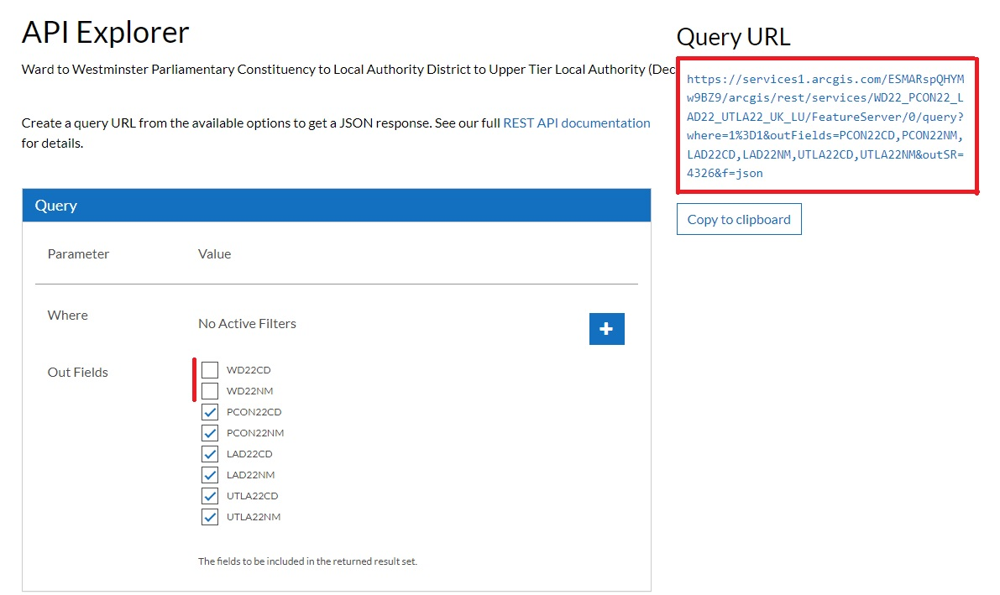
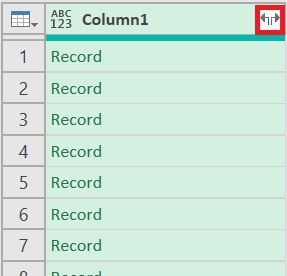

# Finding MPs for each LA using the ONS API

Because I am lazy and I needed the data in Excel, this tutorial covers how to use PowerQuery to download the data (so also appliccable to PowerBI). If you want to use R or Python you will need to find a RESTive API package that deals with panigation. It will probably be a lot easier :)

## Data Sources

We need data on which MP is in which constituency, which we can get from the theyworkforyou API [https://www.theyworkforyou.com/mps/?f=csv](https://www.theyworkforyou.com/mps/?f=csv) (Note that theyworkforyou does actually have an API, and this isn't it, but this is sufficient for us for now).

We also want data on which constituency is in which Local Authority, which is on the ONS Geoportal. The one for 2022 is [here](https://geoportal.statistics.gov.uk/datasets/ons::ward-to-westminster-parliamentary-constituency-to-local-authority-district-to-upper-tier-local-authority-december-2022-lookup-in-the-united-kingdom/about), and this is the dataset I'll use in this tutorial, as it's the most recent one when I'm writing this, but it should soon be out of date, and you should look for a newer version with updated LAs and constituency boundaries.

## Downloading the data

So were done right? Just download the data from each source and then `INDEX/MATCH` / `left_join` them together? WRONG!

There are two problems, one more easily solved than the other.

1. We need to use the API to download the LA data, but by default it will only download the first 1000 objects. Unfortunately, because the file also contains all of the information on wards as well as constituencies, there are over 9000 datapoints in the file, so we need a way to get around this.
1. The two inputs are in different formats, the MP data is in a CSV, which is a lovely rectangle while the LA data is in JSON format, which is very much not a rectangle. 

## Downloading the API data.

We can navigate to the API explorer by pressing "View Full Details" then clicking "View API Resources" on the right hand side, then "Open in API Explorer", or by changing the last part of the url to `/api`. Here we select the columns we need (you can see in the image that I have deselected the two columns for Wards), and copy the query url, which we can use to download the data. 



We need to know how many items there are in this dataset in order to know how many pages of data to read. You're supposed to be able to get this from the API, but it seems to be broken, (it just says 0), and so we can get this off the about page instead (either click back on "Back to Full Details" link, or change the end of the url to `/about`.) Here we can see that there are about 9300 records. 

.

Looking at the API link: 
```
https://services1.arcgis.com/ESMARspQHYMw9BZ9/arcgis/rest/services/WD22_PCON22_LAD22_UTLA22_UK_LU/FeatureServer/0/query?where=1%3D1&outFields=PCON22CD,PCON22NM,LAD22CD,LAD22NM,UTLA22CD,UTLA22NM&outSR=4326&f=json
```

we can see that it is a series of instructions split apart by `&`. 

We can change the results we recieve by adding in a `resultOffset` query, which, rather than beginning at the first result, will get the server to return the 1000 results beginning at the requested entry. So if we add in `resultOffset=1000`, it will give us results 1001 to 2000. 

<details>
    <summary>What do the other instructions do?</summary>

 - `**where**=1%3D1` would allow us to run SQL style `WHERE` commands on the data, e.g. only select rows where `population > 10000` for example. Here we select all of the rows, and so we have `where=1=1` (with `=` encoded as `%3D`)

 - `outfields=...` List of fields to output

 - `outSR=4326` This means nothing for our data, but if we had requested map data (which is what the API is nominally for), it would change the spatial reference of the map.

 - `f=json` output as JSON. Sadly this is actually the most readable of the options for us. 

 You can learn more about the query options on the [arcgis website](https://developers.arcgis.com/rest/services-reference/enterprise/query-feature-service-layer-.htm)
</details>

We therefore want to repeatedly request the next 1000 entries by increasing the `resultOffset`, and stick them all together into a single large JSON object which we can then process. 

### Doing this in Excel

In Excel/PowerBI we can do this using PowerQuery. Again, there are better ways to do this in R and Python. 

In the Data tab, select "Get Data" and then "From Other Sources" and "From Web" (or use the little icon) . Paste the URL in the box and press OK, which will open up PowerQuery.

Here we disregard all of the buttons trying to help us, and open the Advanced Editor.


We can then replace the code in the box (which will only download one page), with some to download all of the pages:

```
let
    BaseURL = "https://services1.arcgis.com/ESMARspQHYMw9BZ9/arcgis/rest/services/WD22_PCON22_LAD22_UTLA22_UK_LU/FeatureServer/0/query?where=1%3D1&outFields=PCON22CD,PCON22NM,LAD22CD,LAD22NM,UTLA22CD,UTLA22NM&outSR=4326&f=json", //Change this URL to your own
    EntitiesPerPage = 1000, // This is fixed by the server
    MaxEntities = 10000, // This is a little over-cautious, but will hopefully not need to be changed if they add more wards

    GetPage = (Index) => // This function gets the page
        let Skip = "&resultOffset=" &Text.From(Index * EntitiesPerPage),
            Url = BaseURL & Skip,
            Json = Json.Document(Web.Contents(Url)),
            Value = Json[features] // Each JSON record holds a lot of data, but we only want the "features"
        in Value,

    PageCount = Number.RoundUp(MaxEntities/EntitiesPerPage), // Work out how many pages are needed
    PageIndicies = { 0 .. PageCount - 1}, // Make a list with each page number in it
    Pages = List.Transform(PageIndicies, each GetPage(_)), // For each page number, replace the number with the actual page from the server
    Entities = List.Union(Pages), // Combine the pages together
    Table = Table.FromList(Entities, Splitter.SplitByNothing(), null, null, ExtraValues.Error) // Convert the list into a PQ table
in
    Table
```

Pressing "Done" should cause a little loading, and then a column full of records will appear. Each record contains a list of attributes, which contain the data that we want, so we need to expand the column, into `Column1.attributes`:



 and then expand the column of attributes to get all of the columns. Deselect the "Use original column name as prefix", as this only muddies up the names, with no benefit to us here. 

 [!Image showing Column Expansion menu](./img/la_mp_tut_pq_second_column.jpg).

 We still have too many columns though, as each constituency shows up once for each ward. Select the first four columns by licking the first column heading, and shift-clicking the fourth (this should select the columns with the ONS codes and names of the constituencies and Lower tier LAs). Then in the "Home" tab select "Remove Rows" and "Remove Duplicates".

 (We need to select the first four columns rather than just the one for constituences because some constituencies are in more than one LA).

 Pressing "Close and Load" will then import the data into Excel.

 ## Downloading the MP data

 This is much simpler. Here we use the same get data from web feature in Excel , and this time use the direct link to the csv from theyworkforyou [https://www.theyworkforyou.com/mps/?f=csv](https://www.theyworkforyou.com/mps/?f=csv), however this time the default settings work fine, and we can simply import the sheet. 

 To make our life a bit easier, we can rename this query (probably called `f=csv`) by going to "Queries & Connections" in the "Data" tab, right-clicking the query, and renaming it (I called it `)

 ## Matching the data

 Luckily for us, the column `PCON22NM` (possibly with a different year number if you used different data), uses exactly the same names as the `Constituency` column in the theyworkforyou data, and so now you CAN simply `INDEX/MATCH` them. If you want to quickly add them to the right of the data from the API, you can use the array forumula

 ```
 =XLOOKUP([@PCON22NM],mp_constituencies[Constituency],mp_constituencies[First name],"-",0)
 ```
 in I2,
 ```
 =XLOOKUP([@PCON22NM],mp_constituencies[Constituency],mp_constituencies[Last name],"-",0)
 ```
 in J2 and 
```
=XLOOKUP([@PCON22NM],mp_constituencies[Constituency],mp_constituencies[Party],"-",0)
```
in K2. 

(Yes it's not `INDEX/MATCH` and it doesn't work in old versions of Excel, but it'll do.)

Now you have a nice rectabngle of all of the 